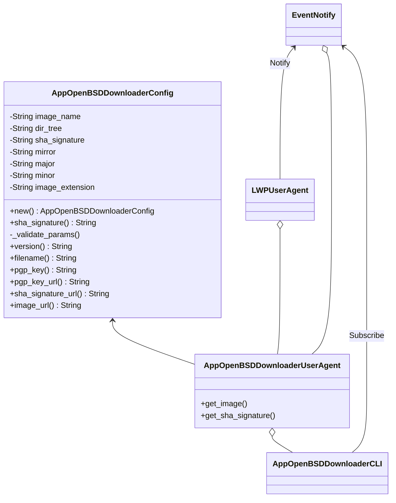

# openbsd-downloader

Downloads install images of OpenBSD given a version and architecture.

## Status

Not ready for usage. Still under construction.

## UML

```mermaid
classDiagram
    AppOpenBSDDownloaderConfig <-- AppOpenBSDDownloaderUserAgent
    AppOpenBSDDownloaderUserAgent o-- AppOpenBSDDownloaderCLI
    LWPUserAgent o-- AppOpenBSDDownloaderUserAgent
    EventNotify o-- AppOpenBSDDownloaderUserAgent
    EventNotify <-- AppOpenBSDDownloaderCLI : Subscribe
    EventNotify <-- LWPUserAgent : Notify
    class AppOpenBSDDownloaderConfig {
        -String image_name
        -String dir_tree
        -String sha_signature
        -String mirror
        -String major
        -String minor
        -String image_extension
        +new() AppOpenBSDDownloaderConfig
        +sha_signature() String
        -_validate_params()
        +version() String
        +filename() String
        +pgp_key() String
        +pgp_key_url() String
        +sha_signature_url() String
        +image_url() String
    }
    class AppOpenBSDDownloaderUserAgent {
        +get_image()
        +get_sha_signature()
    }
```
